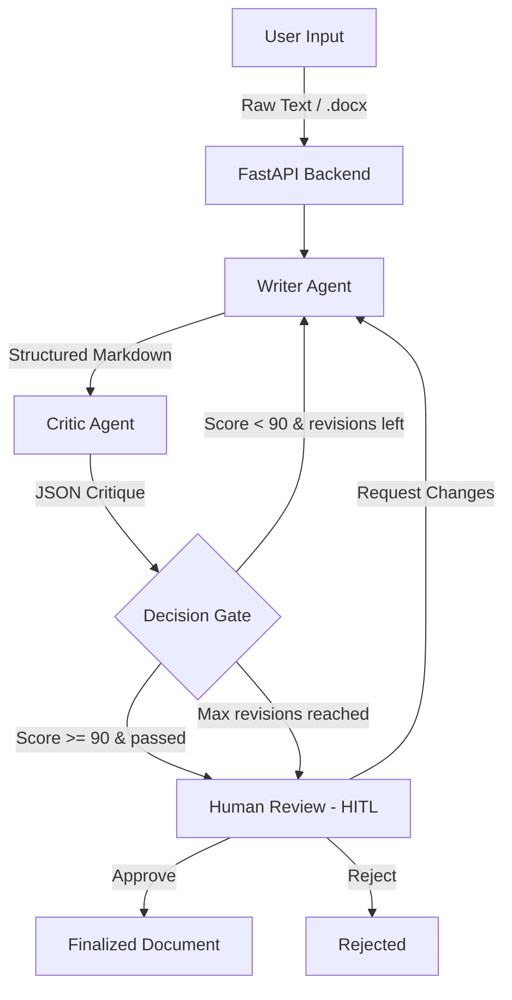

# Agentic AI Document Review System

A multi-agent AI system that transforms messy notes and transcripts into polished, professionally structured documents using an autonomous Writer-Critic feedback loop with Human-in-the-Loop approval.

## Architecture Overview



## How the Agent Graph Works

The system uses **LangGraph** to orchestrate a stateful, cyclic workflow between two AI agents:

### Nodes
| Node | File | Purpose |
|------|------|---------|
| `writer` | `workflow.py` → `agents.py:writer_agent()` | Generates/revises structured Markdown from raw input |
| `critic` | `workflow.py` → `agents.py:critic_agent()` | Evaluates the draft against a strict rubric, outputs JSON feedback |
| `decision` | `workflow.py:decision_node()` | Logic gate — checks score threshold and revision count |
| `human_review` | `workflow.py` | Pauses workflow for human approval via API |
| `max_revisions` | `workflow.py` | Terminal node when revision limit is hit |

### Edges & Routing
- **Entry:** `writer` (always starts here)
- **Sequential:** `writer` → `critic` → `decision`
- **Conditional (from `decision`):**
  - If `score >= 90` AND `passed=true` → `human_review`
  - If `revision_count >= max_revisions` → `max_revisions`
  - Otherwise → `writer` (loops back for revision)

### State Management
The `DocumentState` (Pydantic model) tracks:
- `revision_count` — prevents infinite loops (configurable max 1–5)
- `current_draft` — latest Markdown output
- `critique` — structured JSON feedback (`score`, `passed`, `missing_elements`, `improvement_suggestions`)
- `status` — workflow lifecycle (`drafting` → `reviewing` → `awaiting_approval` → `approved`)

## Tech Stack

| Component | Technology |
|-----------|-----------|
| Backend API | Python, FastAPI |
| Agent Orchestration | LangGraph (StateGraph with cyclic edges) |
| LLM Provider | Groq (llama-3.3-70b-versatile) |
| Data Models | Pydantic v2 |
| File Parsing | python-docx |
| Frontend | Vanilla HTML/CSS/JS (Glassmorphism UI) |

## Supported Document Types

- **Meeting Minutes** — with attendees, decisions, action items
- **Reports** — executive summary, findings, recommendations
- **Memos** — To/From header, key points, actions
- **Proposals** — problem statement, solution, ROI, budget
- **PRD (Product Requirements Document)** — user stories, edge cases, tech specs, success metrics

## Setup & Installation

### Prerequisites
- Python 3.10+
- Groq API key ([get one free](https://console.groq.com/keys))

### Steps

```bash
# 1. Clone the repository
git clone <repo-url>
cd AAA-Document-Review

# 2. Create virtual environment
python -m venv venv
venv\Scripts\activate        # Windows
# source venv/bin/activate   # macOS/Linux

# 3. Install dependencies
pip install -r requirements.txt

# 4. Configure environment
copy .env.example .env
# Edit .env and add your GROQ_API_KEY

# 5. Run the server
python main.py
```

The server starts at `http://localhost:8000`.

## API Endpoints

| Method | Endpoint | Description |
|--------|----------|-------------|
| `POST` | `/documents` | Start workflow from raw text |
| `POST` | `/documents/upload` | Start workflow from .docx file |
| `GET` | `/documents/{id}` | Get document status, draft, and critique |
| `GET` | `/documents/{id}/draft` | Get current draft content |
| `POST` | `/documents/{id}/review` | Submit human review (approve/reject/request_changes) |
| `GET` | `/documents/{id}/final` | Get finalized approved document |
| `GET` | `/active-documents` | List all active sessions |
| `DELETE` | `/documents/{id}` | Delete a document session |
| `GET` | `/health` | Health check |

**Interactive API Docs:** `http://localhost:8000/docs` (Swagger UI)

## Frontend UI

Access the web UI at: `http://localhost:8000/ui/`

Features:
- Drag-and-drop `.docx` upload
- Raw text paste input
- Live polling for workflow progress
- Critique score display with missing elements
- Human review buttons (Approve / Request Changes / Reject)

## Project Structure

```
├── main.py          # FastAPI server & REST endpoints
├── workflow.py      # LangGraph workflow graph (nodes, edges, routing)
├── agents.py        # Writer & Critic agent implementations (Groq LLM)
├── models.py        # Pydantic models (DocumentState, CriticFeedback, etc.)
├── prompts.py       # System prompts with few-shot examples
├── file_parser.py   # .docx text extraction utility
├── requirements.txt # Python dependencies
├── static/
│   └── index.html   # Frontend UI
├── .env.example     # Environment variable template
└── VERIFICATION.md  # Testing guide with PowerShell commands
```

## Key Design Decisions

1. **No Date Fabrication:** The Writer agent is instructed to never invent dates/times not present in the source. The Critic agent explicitly checks for and flags fabricated dates.

2. **Few-Shot Prompting:** Both agents use few-shot examples in their system prompts to establish quality baselines for document structure and critique accuracy.

3. **Structured Output:** The Critic uses Groq's `response_format={"type": "json_object"}` to guarantee parseable JSON output, with a Pydantic fallback for edge cases.

4. **Revision Safety:** `max_revisions` (default 3, max 5) prevents infinite Writer↔Critic loops while still allowing iterative improvement.

## Structured Output Design

The project specification recommends forcing the Critic LLM to output a strict JSON format such as:

```json
{"status": "approved", "feedback": [...]}
```

Our implementation **deliberately expands** this into a richer, more actionable 4-field schema:

```json
{
    "score": 85,
    "passed": false,
    "missing_elements": ["Meeting start time not found", "Action items lack owners"],
    "improvement_suggestions": ["Add meeting time from source", "Assign owners to each action item"]
}
```

### Field Mapping

| Spec Example | Our Implementation | Why |
|--------------|-------------------|-----|
| `"status": "approved"` | `"passed": true/false` + `"score": 0-100` | A boolean + numeric score gives **finer granularity** than a string status. The score drives the conditional edge threshold (≥ 90 to pass), while `passed` acts as the final verdict. |
| `"feedback": [...]` | `"missing_elements": [...]` + `"improvement_suggestions": [...]` | Splitting feedback into **what's wrong** vs. **how to fix it** gives the Writer agent more targeted, actionable context during revision loops — leading to faster convergence. |

### How It's Enforced

1. **Groq JSON Mode** — `response_format={"type": "json_object"}` in `agents.py` guarantees the LLM always returns valid JSON (no free-text parsing or regex needed).
2. **Pydantic Validation** — The `CriticFeedback` model in `models.py` validates field types (`score` is int 0–100, `passed` is bool, lists are arrays of strings).
3. **Fallback Handling** — If JSON parsing fails, the system gracefully defaults to `score=0, passed=false` with an error message, preventing crashes.
4. **Programmatic Override** — Code-based guardrails in `agents.py` (`programmatic_validation()`) apply penalty deductions to the LLM's score and merge additional flags, ensuring the structured output reflects both LLM judgement and hard-coded factual checks.
